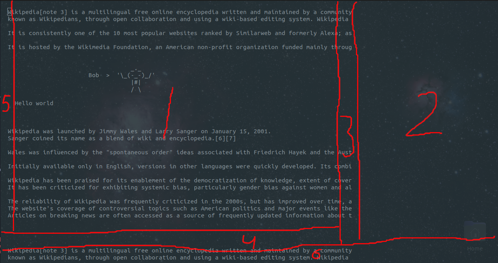
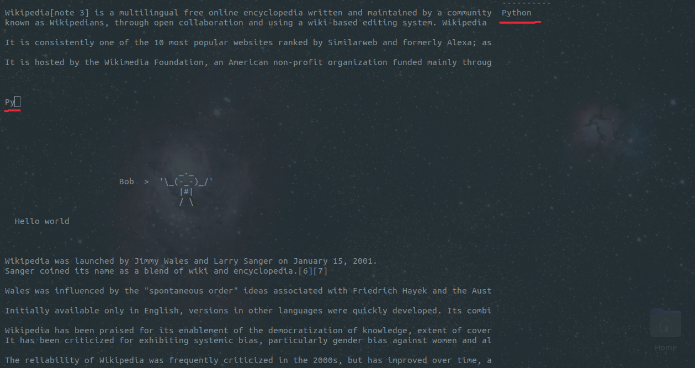

### Як зібрати під Debian

1) Встановлення cmake якщо його немає на вашому комп'ютері:
```bash
sudo apt install cmake
```
2) Встановлення ninja:
```bash
sudo apt install ninja-build
```
3) Потрібно для бібліотеки `fmt`:
```bash
sudo apt install libfmt-dev
```
4) GTK3 потрібен для використання буферів обміну:
```bash
sudo apt install libgtk-3-dev
```
5) Переходимо в теку з проектом
6) Пишемо `cmake -G Ninja`, ця команда створить конфігураційні файли для `ninja`
7) Останній крок це прописати `ninja`, це почне збирати проект, або не збирати і ви отримаєте інформативну помилку)


### Доступні комбінації клавіш
* Ctrl + q - Вийти з програми
* Ctrl + s - Зберегти зміни
* Ctrl + c - Копіювати одне слово яке обмежене пробілами
* Ctrl + l - Копіювати рядок на якому знаходиться курсор
* Ctrl + v - Вставити рядок з буфера


<hr>

PreM створюється для покращення життя Linux-адміністраторам.

Планується зробити редактор коду/файлів конфігурації. Фішка в тому, що для розробників є багато редакторів коду + плагінів під них, для адмінів таких можливостей менше, тому я і вирішив почати писати цей проект.


Це приблизна схема як все буде виглядати (зроблена на колінах).


<br>

### Опис
1. Робоча область, тут буде основна взаємодія користувача з програмою
2. Область для виведення підказок для авто-доповнення
3. Вертикальний повзунок (для покращення орієнтування у файлі)
4. Горизонтальний повзунок
5. Область для нумерації рядків
6. Статус-бар, тут будуть відображатися повідомлення від редактора а також інформація щодо положення курсору


Приклад, як приблизно будуть відображатися підказки. Тут потрібні ще правки.


<br>


<hr>

### Плани на PreM:
* Зробити нарешті нормальну README.md (це буде коли релізну першу версію проги, по-факту вона буде схожа на те що є зараз але з деякими виправленнями)
* Зробити нормальний WindowContainer (планується що цей клас буде чимось подібним до QMainWindow, він буде контейнером для інших вікон)
* Додати декілька типів вікон (в PreM всі віджети будуть називатися вікнами)
    * WindowContainer - як головне вікно-контейнер
    * BufferedWindow - для тексту з прокруткою
    * SimpleWindow - для тексту без прокрутки (можливо буде динамічне, щось подібне до FlexLayout в деяких бібліотеках)
    * (new) Scroll - подібне до ScrollBar але трішки урізаний
    * (new) NumSideBar - вікно для відображення номеру рядка
* Зробити авто-доповнення та почати писати парсер (це буде реалізовано на Python, програма буде служити для створення словників)
