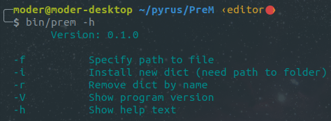
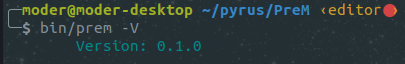
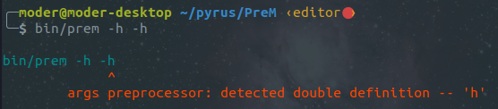
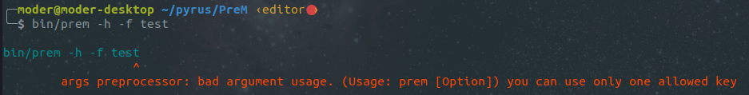
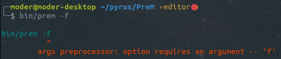
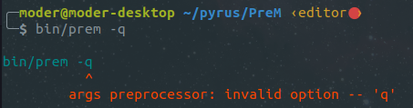

PreM створюється для покращення життя Linux-адміністраторам.

Планується зробити редактор коду/файлів конфігурації. Фішка в тому, що для розробників є багато редакторів коду + плагінів під них, для адмінів таких можливостей менше, тому я і вирішив почати писати цей проект.

Приклад того що є)

 

 

 

 

 

 

  

Пізніше займусь нормальним оформленням README.md, зараз потрібно зробити щось подібне до Layout в деяких бібліотеках для GUI. Також додати можливості для Ctrl+C та пофіксити Ctrl+V (додати можливість встановлення багаторядкового тексту розділеного \n, зараз така штука працює некоректно, але вона працює і це прогрес... ).

